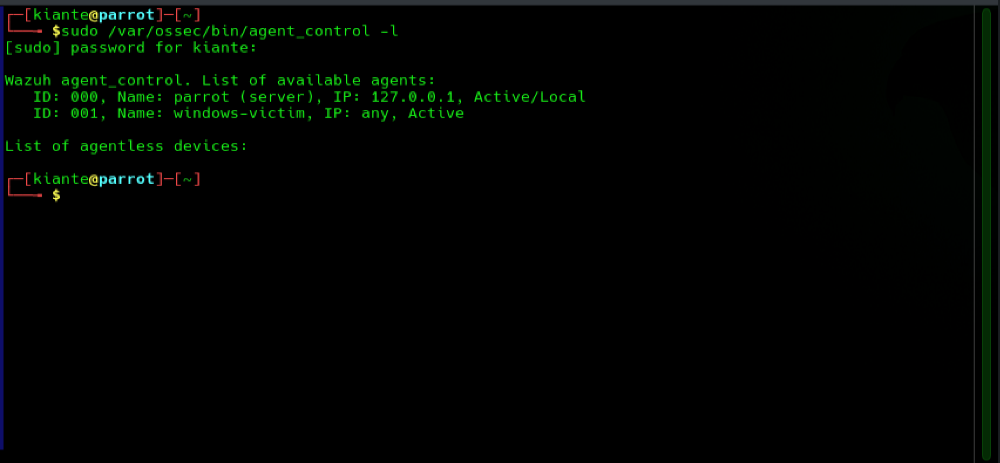
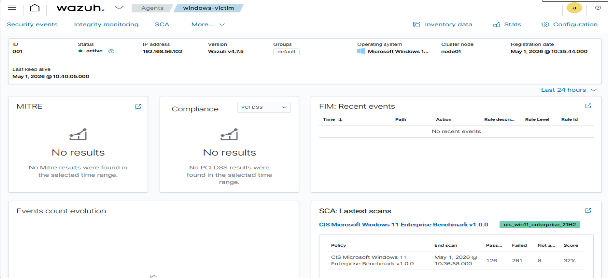
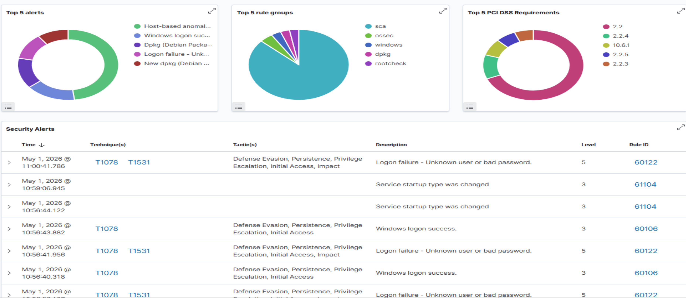
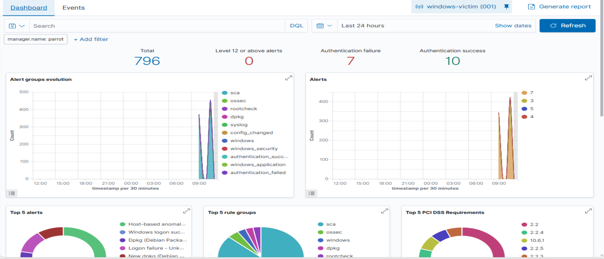
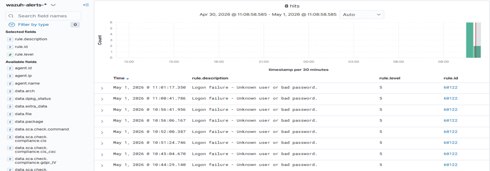
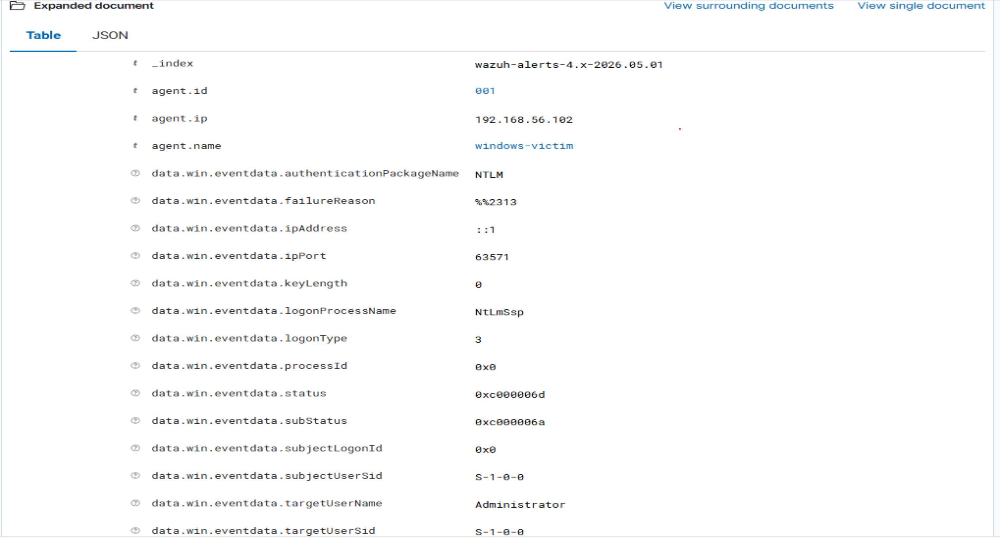
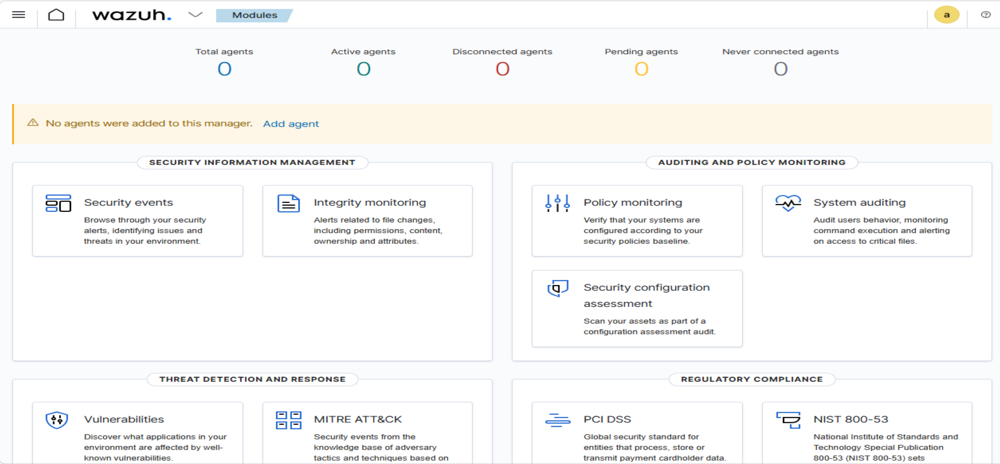
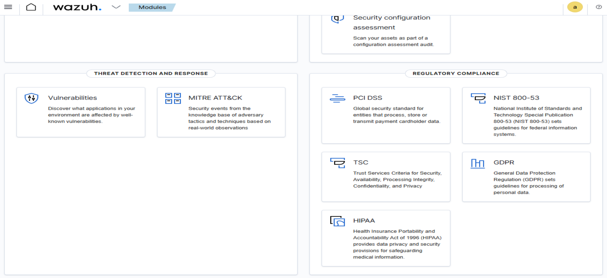

# Wazuh EDR Homelab

> Open-source endpoint detection and response (EDR) platform deployed across a multi-VM homelab environment. Built as part of an active cybersecurity portfolio documenting hands-on SOC analyst skills.

---

## Project Overview

This project documents the full deployment of a **Wazuh v4.7.5 SIEM/EDR stack** on a Parrot OS virtual machine, with a Windows Server 2025 endpoint enrolled as a monitored agent. The lab simulates real-world threat detection scenarios including brute force authentication attacks and automated compliance scanning.

**Completed:** May 1, 2026
**Analyst:** Kiante Nolen

---

## Lab Architecture

```
┌─────────────────────────────────────────────────────┐
│                  Windows Host Machine                │
│                                                     │
│  ┌──────────────────┐      ┌──────────────────────┐ │
│  │   Parrot OS VM   │      │  Windows Server 2025 │ │
│  │                  │      │                      │ │
│  │  Wazuh Manager   │◄────►│   Wazuh Agent 001    │ │
│  │  Wazuh Indexer   │      │   (windows-victim)   │ │
│  │  Wazuh Dashboard │      │                      │ │
│  │  Filebeat        │      │  IP: 192.168.56.102  │ │
│  │                  │      │                      │ │
│  │  192.168.56.101  │      └──────────────────────┘ │
│  └──────────────────┘                               │
│                                                     │
│         VirtualBox Host-Only Network (vboxnet0)     │
│                   192.168.56.0/24                   │
└─────────────────────────────────────────────────────┘
```

| Component | Details |
|---|---|
| Hypervisor | Oracle VirtualBox |
| Manager OS | Parrot OS (Debian-based) |
| Agent OS | Microsoft Windows Server 2025 |
| EDR Platform | Wazuh v4.7.5 |
| Network Type | VirtualBox Host-Only Adapter |
| Manager IP | 192.168.56.101 |
| Agent IP | 192.168.56.102 |

---

## What Was Built

### 1. Wazuh Stack Deployment (Parrot OS)
- Installed Wazuh Manager, Indexer (OpenSearch), Dashboard, and Filebeat as a single-node cluster
- Resolved Parrot OS compatibility (Debian-based, not officially supported) using `-i` flag and manual dependency mocking via `equivs`
- Configured btrfs-compatible swap (2GB) to handle OpenSearch memory requirements
- Tuned JVM heap to `512m` to stabilize indexer on 6GB VM RAM
- Created missing log directories required by the OpenSearch GC logger

### 2. Network Configuration
- Configured VirtualBox Host-Only Adapter (`vboxnet0`) on both VMs
- Verified bidirectional connectivity via ICMP ping between `192.168.56.101` and `192.168.56.102`
- Maintained NAT adapter on both VMs for internet access during package installation

### 3. Windows Agent Enrollment
- Downloaded and silently installed Wazuh Agent v4.7.5 MSI on Windows Server 2025 VM
- Enrolled agent pointing to manager at `192.168.56.101`
- Confirmed Agent ID 001 (`windows-victim`) reporting Active status in dashboard

### 4. Threat Detection — Brute Force Simulation
- Enabled Windows audit policy for logon failure events via `auditpol`
- Simulated brute force attack using repeated `net use` authentication failures against local Administrator account
- Generated **16 Rule 60122 alerts** (Logon failure — Unknown user or bad password)
- Confirmed MITRE ATT&CK tagging: **T1078** (Valid Accounts), **T1531** (Account Access Removal)

### 5. Security Configuration Assessment (SCA)
- Wazuh automatically ran CIS Microsoft Windows Server 2025 Benchmark scan on agent registration
- Results: **126 passed / 261 failed / 8 N/A — 32% compliance score**
- Identified hardening gaps across access control, audit policy, and service configuration

---

## Alert Evidence

### Rule 60122 — Brute Force Authentication Failure

| Field | Value |
|---|---|
| Rule ID | 60122 |
| Rule Level | 5 (Medium) |
| Targeted Account | Administrator |
| Authentication Package | NTLM |
| Logon Type | 3 (Network) |
| Logon Process | NtLmSsp |
| Failure Status | 0xc000006d (invalid credentials) |
| Failure SubStatus | 0xc000006a (wrong password) |
| MITRE Tactics | Defense Evasion, Persistence, Privilege Escalation, Initial Access |
| Total Alerts | 16 |

### Dashboard Summary
- **Total Events:** 796
- **Authentication Failures:** 7 (dashboard counter) / 16 (raw alert hits)
- **Authentication Successes:** 10
- **Level 12+ Critical Alerts:** 0

---

## Screenshots

### Agent Active — Terminal Confirmation


### Wazuh Dashboard — Agent Connected


### Security Alerts Table with MITRE ATT&CK Tags


### Dashboard Summary — Authentication Failure Metrics


### Events Filtered by Rule ID 60122


### Expanded Forensic Alert Detail


### Wazuh Modules Overview


### Compliance and Threat Detection Modules


---

## Incident Report

A full mock incident report (`IR-2026-001-Wazuh-EDR-Lab.md`) is included in this repository documenting:
- Incident timeline with exact timestamps
- Full IOC table (status codes, SIDs, auth packages)
- Technical analysis with MITRE ATT&CK mapping
- Remediation recommendations
- Evidence index

---

## Key Technical Challenges Solved

| Challenge | Solution |
|---|---|
| Parrot OS not supported by Wazuh installer | Used `-i` flag to bypass OS check |
| `software-properties-common` unavailable on Parrot | Created dummy package via `equivs` |
| OOM kill during install (3.8GB RAM) | Increased VM RAM to 6GB + added 2GB btrfs swap |
| btrfs incompatible with standard swapfile | Used `btrfs filesystem mkswapfile` method |
| OpenSearch heap too large (1958m auto-set) | Manually capped to `512m` in `jvm.options` |
| Missing GC log directory crashed indexer | Created `/var/log/wazuh-indexer/` with correct permissions |
| VMs couldn't communicate (NAT isolation) | Added Host-Only Adapter (vboxnet0) to both VMs |
| Windows audit policy not logging failures | Enabled via `auditpol /set /subcategory:"Logon" /failure:enable` |
| Filebeat stopped shipping alerts | Re-enabled and started Filebeat service |

---

## Skills Demonstrated

- **SIEM/EDR Deployment** — Single-node Wazuh stack from scratch
- **Linux Administration** — Service management, memory tuning, filesystem configuration
- **Network Configuration** — VirtualBox networking, Host-Only adapters, connectivity troubleshooting
- **Windows Security** — Audit policy configuration, event log analysis, Windows Event IDs
- **Threat Detection** — Brute force simulation, rule-based alerting, MITRE ATT&CK mapping
- **Incident Response** — Alert triage, forensic data analysis, formal incident report writing
- **Compliance** — CIS benchmark interpretation, SCA findings analysis

---

## MITRE ATT&CK Coverage

| Technique | ID | Tactic |
|---|---|---|
| Valid Accounts | T1078 | Defense Evasion, Persistence, Privilege Escalation, Initial Access |
| Account Access Removal | T1531 | Impact |

---

## Certifications

- CompTIA Security+ (SY0-701)
- Google AI Essentials
- Google Prompting Essentials

---

## Repository Structure

```
wazuh-edr-homelab/
├── README.md
├── IR-2026-001-Wazuh-EDR-Lab.md
└── screenshots/
    ├── wazuh-agent-active-windows-victim.png
    ├── wazuh-dashboard-agent-connected.png
    ├── wazuh-dashboard-agent-connected-mid.png
    ├── wazuh-dashboard-auth-failure-alerts-top.png
    ├── wazuh-rule-60122-logon-failures.png
    ├── wazuh-alert-detail-60122.png
    ├── dashboard-top.png
    └── dashboard-bottom.png
```

---

## References

- [Wazuh Documentation](https://documentation.wazuh.com)
- [MITRE ATT&CK Framework](https://attack.mitre.org)
- [CIS Benchmarks](https://www.cisecurity.org/cis-benchmarks)
- [CompTIA Security+ SY0-701](https://www.comptia.org/certifications/security)

---

*Part of an active cybersecurity homelab portfolio. Additional projects cover network scanning, vulnerability assessment, and cloud security.*